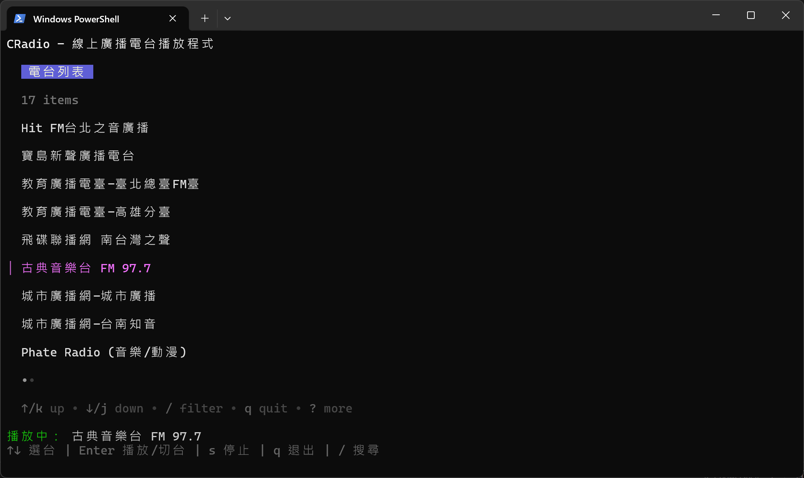

# CRadio

在終端機裡收聽線上廣播電台。



## 系統需求

- Go 1.20+ (如要自行編譯原始碼)
- mpv (必要)

CRadio 使用 mpv 作為子行程播放線上廣播電台，所以需要先安裝 mpv。

### 安裝 mpv

- Windows：在 Microsoft Store 裡安裝 [mpv (Unofficial)](https://apps.microsoft.com/detail/9P3JFR0CLLL6?hl=neutral&gl=TW&ocid=pdpshare)。


## 下載執行檔

從 [GitHub Releases](https://github.com/riddleling/cradio/releases) 頁面下載 `CRadio.zip`，並解壓縮。

## 執行 CRadio

- 執行 `cradio.exe`
- 檔案 `list.json` 是電台列表，你可自行編輯與維護此列表。


## 從原始碼編譯

```
git clone https://github.com/riddleling/cradio.git
cd cradio
go mod tidy
go build
```

## License

MIT License
